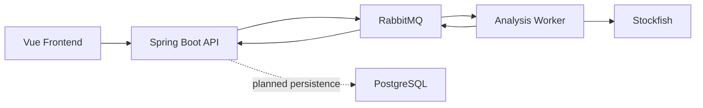

# Architecture

Chess Lab is local-first but service-shaped. The first version runs on one machine, while the service boundaries mirror a deployable system.

## Services

- `frontend`: user interface for PGN import, game review, analysis progress, and mistake drills.
- `api-service`: owns the HTTP API, in-memory game records for the first slice, analysis job lifecycle, request publishing, result consumption, and report reads.
- `analysis-worker`: consumes queued analysis requests, owns Stockfish process integration, move classification, and completed report publishing.
- `rabbitmq`: local queue boundary between API and worker.
- `postgres`: planned durable storage once the engine loop is functional.

## V1 Constraints

- Local-first only.
- Stockfish-only analysis.
- No AI summaries.
- No accounts.
- No chess.com or Lichess import.
- Local Kubernetes is supported for orchestration practice; it still uses local images and local-only services.

## Analysis Flow

1. User imports a PGN in the Vue app.
2. API stores the game and normalized moves.
3. User starts analysis.
4. API creates an analysis job.
5. API publishes work to RabbitMQ.
6. Worker runs Stockfish on relevant positions.
7. Worker publishes move evaluations and mistake classifications back to RabbitMQ.
8. Frontend polls job/report endpoints and renders the report.
9. API consumes worker results and updates the in-memory report served by the polling endpoint.
